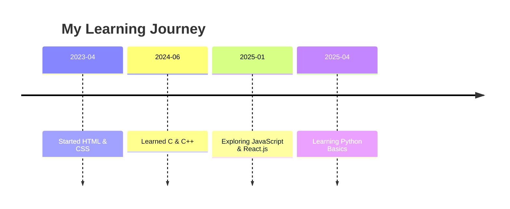

# 👋 Hi, I'm **Mst. Jannatun Ferdous Ety**  

🎓 **Undergraduate Student** – Computer Science & Engineering (B.Sc. CSE)  
💻 Passionate about **Coding, Web Development, and Problem-Solving**  
🌱 Currently exploring **Python, Data Structures, and Web Technologies**  
🎯 Aspiring **Software Engineer** who builds scalable & impactful solutions  

---

## 🧭 About Me  

- 🔭 Currently learning **Python, Java, C, C++**  
- 🌐 Exploring **Web Development, Software Engineering & AI**  
- 💡 Enthusiastic about **Competitive Programming & Algorithms**  
- 🚀 Vision: To become a **skilled software engineer** who creates reliable, user-friendly, and innovative applications  

---

## 🛠 Tech Stack  

### 💻 Programming Languages  

  

### 🌐 Web Development  

  

### ⚙️ Tools & Platforms  

  

---

## 📊 GitHub Stats  

  
  

---

## 📅 Learning Journey  

---

## 📫 Connect With Me  

  
  

---

✨ _“Code is like humor. When you have to explain it, it’s bad.”_ ✨  
